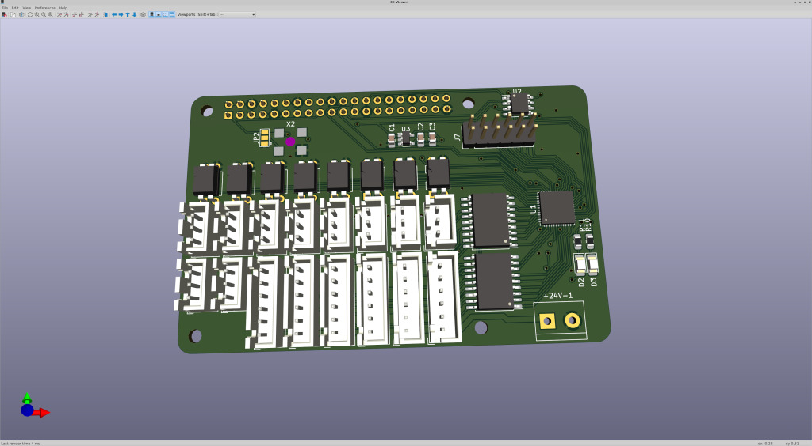

# rio-iceshield
6 Axis LinuxCNC-RIO Raspberry-PI FPGA-Hat - kicad project

**experimental**

## software / gateware
https://github.com/multigcs/riocore

## BOM

## Forum
German: https://www.cnc-aus-holz.at/index.php?thread/3130-experimente-mit-linux-cnc-auf-raspi-und-ice40-fpga-als-mesa-alternative/&postID=40335#post40335
English: https://forum.linuxcnc.org/18-computer/49142-linuxcnc-rio-realtimeio-for-linuxcnc-based-on-fpga-ice40-ecp5
